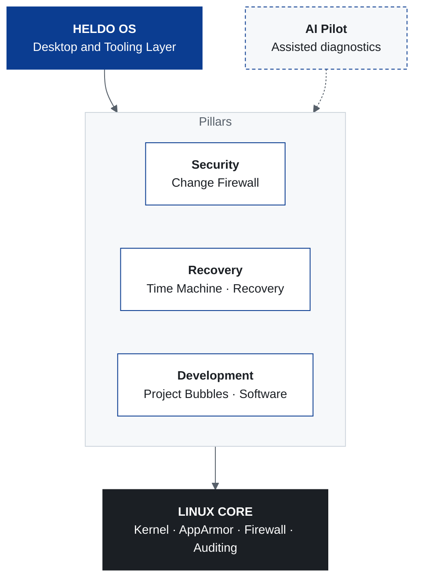

 

# HELDO OS

**A Linux desktop engineered for security, control, and recovery.**

 

 

[Overview](#overview) &nbsp;|&nbsp;
[Capabilities](#core-capabilities) &nbsp;|&nbsp;
[Architecture](#architecture) &nbsp;|&nbsp;
[Screenshots](#screenshots) &nbsp;|&nbsp;
[Roadmap](#roadmap) &nbsp;|&nbsp;
[Contributing](#contributing)

 

## Overview

Heldo OS is a Linux-based operating system that unifies **system protection**, **recovery**, **isolated development environments**, and **AI-assisted troubleshooting** in a single desktop.

Most operating systems make it easy to change the system and hard to understand or undo those changes. Heldo OS is designed around the opposite principle: every sensitive change should be visible, controllable, and reversible.

> **Control your system. Understand what is happening. Recover when something goes wrong.**

> [!NOTE]
> Heldo OS is under active development. Components are at different stages of maturity; see [Project Status](#project-status) for details.

 

## Design Principles

| Principle | Description |
|:--|:--|
| **Security** | Protection is part of the base system, not an optional add-on. |
| **Control** | The user decides what is allowed to change the system. |
| **Transparency** | System activity is visible and explained. |
| **Isolation** | Development workloads run apart from the host. |
| **Recoverability** | Unwanted changes can be reversed. |

 

## Core Capabilities

### Heldo Change Firewall

Policy-based control over sensitive system modifications made by applications, scripts, automation, administrative operations, and AI-assisted operations.

### Heldo Time Machine

Recovery-oriented system design: recovery points, system rollback, configuration restoration, and pre-update snapshots.

### Heldo Recovery

A dedicated environment for system maintenance, covering diagnostics, boot recovery, configuration repair, and full system restoration.

### Heldo AI Pilot

An assistant that helps users analyze errors, inspect configuration, and troubleshoot issues, recommending corrective actions while keeping the user in control of every change.

### Heldo Project Bubbles

Isolated development environments that keep the host system clean and predictable.

| Languages and Runtimes | Platforms and Workloads |
|:--|:--|
| Python | Cloud Development |
| Web Development | DevOps |
| Java | Kubernetes |
| C / C++ | Containers |
| Go | AI / ML |

### Heldo Software

A unified experience to discover, install, update, and manage applications and developer tools.

 

## Security Foundation

Heldo OS is built around established Linux security technologies and secure-by-default configuration.

| Domain | Controls |
|:--|:--|
| Access Control | AppArmor, privilege management |
| Network | Firewall management |
| Auditing | System auditing |
| Isolation | Application isolation, sandboxed workloads |
| Maintenance | Security updates, secure system configuration |

 

## Architecture

Heldo OS combines a customized desktop and a set of Heldo-specific tools on top of a standard Linux core, organized into three pillars. AI Pilot assists across all of them.

 

## Screenshots

<b>Desktop</b>

  

<b>Application Center</b>

<!--
Add more screenshots the same way, for example:

-->

 

## Intended Users

Heldo OS targets professionals who need a productive desktop without giving up system control:

Software Developers · Cloud Engineers · DevOps Engineers · SRE Engineers · System Administrators · Security Engineers · AI/ML Engineers · Linux Enthusiasts

 

## Project Status

| Component | Stage |
|:--|:--|
| Core system design | Complete |
| Custom desktop | Complete |
| Change Firewall | In development |
| Time Machine | In development |
| Recovery environment | In development |
| Project Bubbles | In development |
| Heldo Software | In development |
| AI Pilot | Planned |

 

## Roadmap

- [x] Core concept and system design
- [x] Custom desktop experience
- [ ] Change Firewall: policy engine and approval prompts
- [ ] Time Machine: recovery points and rollback
- [ ] Recovery: boot and configuration repair environment
- [ ] Project Bubbles: initial set of isolated environments
- [ ] Heldo Software: unified install and update experience
- [ ] AI Pilot: assisted diagnostics with user approval
- [ ] First public ISO release

 

## Getting Started

Installation images and instructions will be published with the first public release. Watch this repository (**Watch › Custom › Releases**) to be notified.

 

## Contributing

Bug reports, feature ideas, and feedback are welcome.

1. Fork the repository
2. Create a feature branch: `git checkout -b feature/short-description`
3. Commit your changes with a clear message
4. Open a pull request describing the change

For questions or proposals, [open an issue](../../issues).

 

## Security

If you discover a security vulnerability, please report it privately to the maintainer rather than opening a public issue.

 

## License

A license has not yet been selected. Until one is added, all rights are reserved by the author.

 

<b>Heldo OS</b> &nbsp;·&nbsp; Security &nbsp;·&nbsp; Control &nbsp;·&nbsp; Recovery

