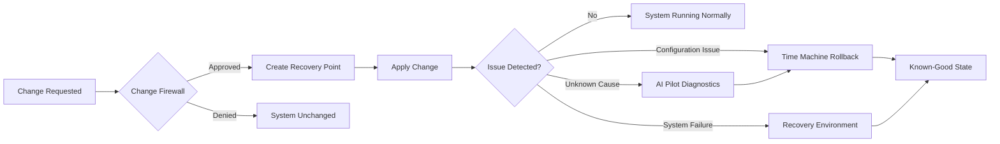

<p align="center">
  
</p>

<h3 align="center">
  A Linux desktop where every sensitive change is visible, controllable, and reversible.
</h3>

<p align="center">
  
  
  
  
</p>

<p align="center">
  
</p>

## Overview

**Heldo OS** is a security-focused Linux desktop designed around three principles:

> **Review. Protect. Recover.**

Instead of allowing sensitive system changes to happen silently, Heldo OS is designed to make important changes visible to the user, request explicit approval, and provide a path to recovery when something goes wrong.

Heldo OS brings system protection, recovery, isolated development environments, software management, and AI-assisted diagnostics together into a single desktop experience.

> [!NOTE]
> **Heldo OS is currently under active development.** Features and components are being implemented incrementally and may not yet be suitable for production use.

### The Problem

Modern Linux systems provide powerful tools, but managing a development or engineering workstation can still involve significant risk:

- Package installations can modify system configuration.
- Scripts can make privileged changes without clear visibility.
- Development dependencies can accumulate on the host system.
- Diagnosing system failures often requires manual investigation.
- Recovering from a bad configuration can be difficult.
- AI-powered tools can suggest fixes without providing sufficient control over execution.

### The Heldo Approach

Heldo OS aims to address these challenges at the operating-system level.

Every sensitive operation should be:

**Visible → Reviewed → Approved → Protected → Reversible**

---

## Design Principles

| Principle | Description |
|:--|:--|
| **Security** | Security controls are integrated into the operating-system experience rather than treated as optional add-ons. |
| **Control** | Users remain in control of operations that can modify the system. |
| **Transparency** | Important system activity is surfaced and explained in understandable terms. |
| **Isolation** | Development workloads and dependencies can be separated from the host system. |
| **Recoverability** | System changes should have a clear path to rollback or recovery. |

---

## Core Capabilities

<p align="center">
  
</p>

| Capability | Purpose |
|:--|:--|
| **Change Firewall** | Monitors sensitive system changes and provides an approval layer before protected operations are applied. |
| **Time Machine** | Creates recovery points that allow the system to return to a previous known-good state. |
| **Recovery Environment** | Provides a dedicated environment for repairing boot, configuration, and system-level failures. |
| **AI Pilot** | Assists with troubleshooting by analyzing problems, explaining potential causes, and proposing solutions. |
| **Project Bubbles** | Provides isolated development environments for project dependencies and workloads. |
| **Heldo Software** | Provides a unified interface for discovering, installing, and updating software. |

### Project Bubbles

Project Bubbles are designed to keep development workloads separated from the host system.

| Languages & Runtimes | Engineering Workloads |
|:--|:--|
| Python | Cloud development |
| Java | DevOps |
| C / C++ | Kubernetes |
| Go | Containers |
| Web development | AI / ML |

### Security Foundation

| Domain | Controls |
|:--|:--|
| **Access Control** | AppArmor, privilege management |
| **Network Security** | Firewall management |
| **Auditing** | System activity and security auditing |
| **Isolation** | Application isolation and sandboxed workloads |
| **Maintenance** | Security updates and secure system configuration |

---

## How It Works

Heldo OS follows a simple operational model:

**Review → Protect → Recover**



### Review

Sensitive operations are surfaced to the user rather than being silently applied.

### Protect

Approved operations can be associated with recovery points so that the system has a defined rollback path.

### Recover

When something goes wrong, users can investigate the issue, restore a previous state, or enter the recovery environment.

---

## Architecture

Heldo OS combines a customized Linux desktop with a collection of Heldo components designed around system protection, recovery, and isolated workloads.

<p align="center">
  
</p>

### Architectural Pillars

| Pillar | Purpose |
|:--|:--|
| **Protection** | Control and monitor sensitive system operations. |
| **Recovery** | Provide recovery points and dedicated repair capabilities. |
| **Isolation** | Separate development workloads from the host environment. |
| **Assistance** | Provide AI-assisted diagnostics and troubleshooting. |

---

## Screenshots

### Heldo OS Desktop

<p align="center">
  
</p>

### Heldo Software

<p align="center">
  
</p>

---

## Target Users

Heldo OS is designed for users who require a controlled and recoverable engineering workstation.

| User | Primary Use Case |
|:--|:--|
| **Software Developers** | Isolated development environments and dependency management |
| **Cloud Engineers** | Cloud tooling and infrastructure workflows |
| **DevOps Engineers** | Containers, Kubernetes, CI/CD and automation |
| **SREs** | System reliability and recovery |
| **System Administrators** | Controlled system administration |
| **Security Engineers** | Security-focused workstation management |
| **AI / ML Engineers** | Isolated AI development environments |
| **Linux Power Users** | Greater visibility and control over system changes |

---

## Project Status

Heldo OS is currently in active development.

| Component | Status |
|:--|:--|
| Core system design |  |
| Custom desktop |  |
| Change Firewall |  |
| Time Machine |  |
| Recovery Environment |  |
| Project Bubbles |  |
| Heldo Software |  |
| AI Pilot |  |

> [!WARNING]
> Heldo OS is a development project. Do not rely on unreleased components for production systems or critical workloads.

---

## Roadmap

### Foundation

- [x] Core system concept
- [x] System architecture
- [x] Custom desktop experience

### Protection

- [ ] Change Firewall policy engine
- [ ] Protected operation detection
- [ ] Approval and review interface
- [ ] System activity visibility

### Recovery

- [ ] Time Machine recovery points
- [ ] System rollback
- [ ] Recovery environment
- [ ] Boot repair workflows

### Development

- [ ] Project Bubbles
- [ ] Initial development environments
- [ ] Container and Kubernetes workflows
- [ ] Cloud development environments

### Software

- [ ] Heldo Software application center
- [ ] Software installation workflows
- [ ] Software update management

### Intelligence

- [ ] AI Pilot diagnostics
- [ ] Log and error analysis
- [ ] Suggested remediation
- [ ] User-approved remediation workflows

### Release

- [ ] First public ISO
- [ ] Installation documentation
- [ ] Release process
- [ ] Public documentation

Feature requests and development discussions can be submitted through [GitHub Issues](../../issues).

---

## Getting Started

Heldo OS is currently under development and does not yet have a public installation image.

Installation instructions and ISO images will be published when the first public release is available.

### Follow Development

To receive release notifications:

**GitHub → Watch → Custom → Releases**

---

## FAQ

<details>
<summary><b>What is Heldo OS?</b></summary>
<br>

Heldo OS is a Linux-based operating system focused on security, system control, recoverability, and isolated development.

It combines a customized desktop with a collection of Heldo components designed to make system changes more visible and manageable.

</details>

<details>
<summary><b>Is Heldo OS a Linux distribution?</b></summary>
<br>

Heldo OS is being developed as a Linux-based operating system built around a standard Linux foundation with a customized desktop and Heldo-specific system components.

</details>

<details>
<summary><b>Can I install Heldo OS today?</b></summary>
<br>

Not yet. Public installation images will be provided with the first public release.

</details>

<details>
<summary><b>Does AI Pilot automatically modify my system?</b></summary>
<br>

No. The intended design is for AI Pilot to provide diagnostics and proposed solutions while keeping the user in control of actions that modify the system.

</details>

<details>
<summary><b>What are Project Bubbles?</b></summary>
<br>

Project Bubbles are isolated development environments intended to keep project dependencies and workloads separated from the host operating system.

</details>

<details>
<summary><b>Is Heldo OS open source?</b></summary>
<br>

The project's final licensing model has not yet been selected. Until a license is officially published, the repository remains under the rights of its author.

</details>

---

## Contributing

Contributions, technical feedback, bug reports, and feature proposals are welcome.

### Development Workflow

1. Fork the repository.
2. Create a feature branch.

```bash
git checkout -b feature/short-description
```

3. Make your changes.
4. Test the changes locally.
5. Commit with a clear and descriptive message.

```bash
git commit -m "Add short description of change"
```

6. Push your branch.

```bash
git push origin
