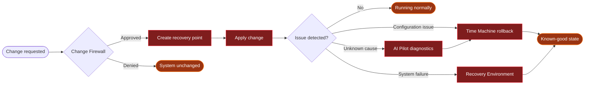

  

  
  
  
  

  <a href="#overview">Overview</a> ·
  <a href="#core-capabilities">Capabilities</a> ·
  <a href="#how-it-works">How it works</a> ·
  <a href="#screenshots">Screenshots</a> ·
  <a href="#project-status">Status</a> ·
  <a href="#roadmap">Roadmap</a> ·
  <a href="#faq">FAQ</a> ·
  <a href="#contributing">Contributing</a>

> [!NOTE]
> **Heldo OS is under active development.** Components are built step by step and are not ready for production use. There is no public ISO yet.

## Overview

**Heldo OS** is a security-focused Linux desktop built on three ideas: **Review. Protect. Recover.**

Sensitive system changes don't happen silently. You see them, approve them, and have a way back if something breaks. Protection, recovery, isolated development environments, software management, and AI-assisted diagnostics live in one desktop.

### The problem

Managing a development workstation on Linux is powerful, but risky:

- Package installs can change system configuration.
- Scripts can make privileged changes without clear visibility.
- Development dependencies pile up on the host.
- Diagnosing failures means manual investigation.
- Recovering from a bad configuration is hard.
- AI tools can suggest fixes, but give you little control over what runs.

### The Heldo approach

Every sensitive operation should be:

  <b>Visible</b> → <b>Reviewed</b> → <b>Approved</b> → <b>Protected</b> → <b>Reversible</b>

## Design principles

| Principle | What it means |
|:--|:--|
| 🛡️ **Security** | Controls are part of the OS experience, not optional add-ons. |
| 🎛️ **Control** | You stay in charge of anything that modifies the system. |
| 🔍 **Transparency** | Important activity is surfaced and explained in plain terms. |
| 🫧 **Isolation** | Development workloads are kept apart from the host. |
| ⏪ **Recoverability** | Every change has a clear path to rollback or recovery. |

## Core capabilities

  

<b>Project Bubbles: supported environments</b>

 

| Languages & runtimes | Engineering workloads |
|:--|:--|
| Python | Cloud development |
| Java | DevOps |
| C / C++ | Kubernetes |
| Go | Containers |
| Web development | AI / ML |

<b>Security foundation</b>

 

| Domain | Controls |
|:--|:--|
| **Access control** | AppArmor, privilege management |
| **Network security** | Firewall management |
| **Auditing** | System activity and security auditing |
| **Isolation** | Application isolation and sandboxed workloads |
| **Maintenance** | Security updates and secure system configuration |

## How it works

| Step | What happens |
|:--|:--|
| **Review** | Sensitive operations are shown to you instead of being applied silently. |
| **Protect** | Approved operations get a recovery point, so there is always a way back. |
| **Recover** | Investigate the issue, restore a previous state, or boot the recovery environment. |

## Architecture

  

| Pillar | Purpose |
|:--|:--|
| **Protection** | Control and monitor sensitive system operations. |
| **Recovery** | Provide recovery points and a dedicated repair environment. |
| **Isolation** | Keep development workloads away from the host. |
| **Assistance** | AI-assisted diagnostics and troubleshooting. |

## Screenshots

<table>
  <tr>
    <td align="center" width="50%">
       
      <b>Heldo OS desktop</b>
    </td>
    <td align="center" width="50%">
       
      <b>Heldo Software</b>
    </td>
  </tr>
</table>

## Who it's for

| User | Primary use |
|:--|:--|
| **Software developers** | Isolated environments and dependency management |
| **Cloud engineers** | Cloud tooling and infrastructure workflows |
| **DevOps engineers** | Containers, Kubernetes, CI/CD, automation |
| **SREs** | Reliability and recovery |
| **System administrators** | Controlled system administration |
| **Security engineers** | Security-focused workstation management |
| **AI / ML engineers** | Isolated AI development environments |
| **Linux power users** | More visibility and control over system changes |

## Project status

| Component | Status |
|:--|:--|
| Core system design |  |
| Custom desktop |  |
| Change Firewall |  |
| Time Machine |  |
| Recovery Environment |  |
| Project Bubbles |  |
| Heldo Software |  |
| AI Pilot |  |

> [!WARNING]
> Don't rely on unreleased components for production systems or critical workloads.

## Roadmap

| Area | Goals | Progress |
|:--|:--|:--|
| **Foundation** | Core concept, architecture, custom desktop | ✅ Done |
| **Protection** | Policy engine · protected-operation detection · approval UI · activity visibility | 🔨 In progress |
| **Recovery** | Recovery points · rollback · recovery environment · boot repair | 🔨 In progress |
| **Development** | Project Bubbles · starter environments · containers & Kubernetes · cloud dev | 🔨 In progress |
| **Software** | Application center · install workflows · update management | 🔨 In progress |
| **Intelligence** | AI Pilot diagnostics · log analysis · suggested fixes · user-approved remediation | 🗓️ Planned |
| **Release** | First public ISO · install docs · release process · public docs | 🗓️ Planned |

Feature requests and discussion: [GitHub Issues](../../issues).

## Getting started

There is no public installation image yet. ISO images and install instructions will be published with the first release.

**Follow development:** GitHub → Watch → Custom → Releases

## FAQ

<b>What is Heldo OS?</b>

 

A Linux-based operating system focused on security, system control, recoverability, and isolated development. It combines a customized desktop with Heldo components that make system changes visible and manageable.

<b>Is Heldo OS a Linux distribution?</b>

 

It's being built on a standard Linux foundation, with a customized desktop and Heldo-specific system components.

<b>Can I install it today?</b>

 

Not yet. Public images will ship with the first public release.

<b>Does AI Pilot change my system automatically?</b>

 

No. AI Pilot provides diagnostics and proposed solutions. You stay in control of any action that modifies the system.

<b>What are Project Bubbles?</b>

 

Isolated development environments that keep project dependencies and workloads separate from the host OS.

<b>Is Heldo OS open source?</b>

 

The license hasn't been chosen yet. Until one is published, all rights remain with the author.

## Contributing

Contributions, technical feedback, bug reports, and feature proposals are welcome.

1. Fork the repository.
2. Create a branch: `git checkout -b feature/short-description`
3. Make and test your changes locally.
4. Commit with a clear message: `git commit -m "Add short description of change"`
5. Push: `git push origin feature/short-description`
6. Open a pull request that covers what changed, why, how you tested it, and any known limitations.

Questions or proposals? Open an [Issue](../../issues).

## Security policy

If you find a potential vulnerability:

- **Don't report it in a public GitHub issue.**
- Report it privately to the project maintainer, with enough detail to reproduce it.
- Please don't share exploit details publicly until it has been investigated.

A dedicated reporting process will be published before the first public release.

## License

No license has been selected yet. Until one is added, **all rights are reserved by the author**.

  <b>Heldo OS</b> · Review. Protect. Recover.

