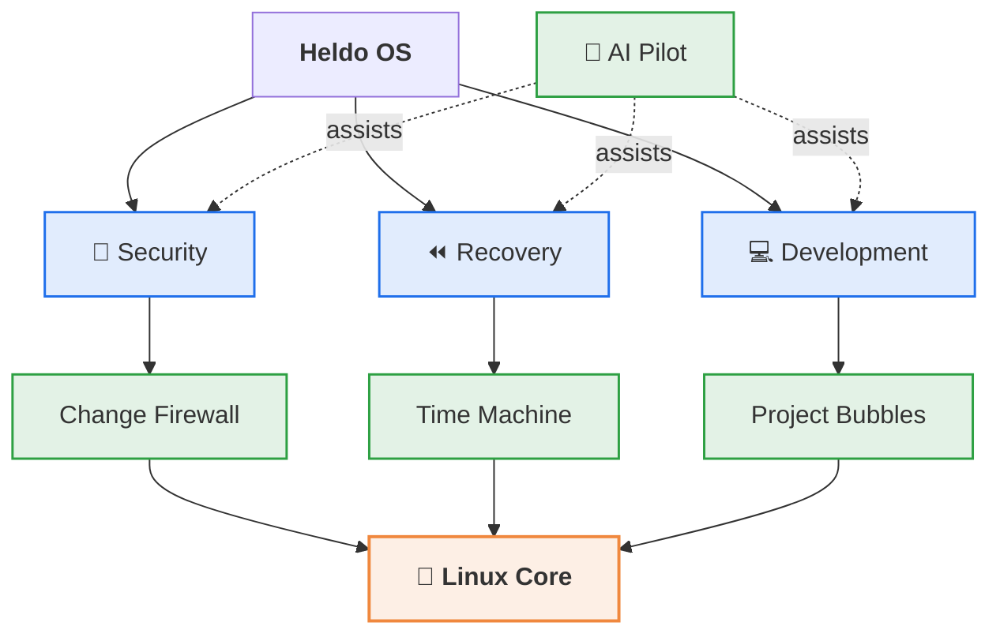

<div align="center">


# Heldo OS

### A Linux desktop built for security, control, recovery, and developer experience.

**Control your system. Understand what is happening. Recover when something goes wrong.**

<br>


<br>

[**Features**](#-features) &nbsp;·&nbsp;
[**Screenshots**](#-screenshots) &nbsp;·&nbsp;
[**Architecture**](#-architecture) &nbsp;·&nbsp;
[**Roadmap**](#-roadmap) &nbsp;·&nbsp;
[**Contributing**](#-contributing)

</div>

---

## 📖 Table of Contents

- [About](#-about)
- [Vision](#-vision)
- [Features](#-features)
- [Screenshots](#-screenshots)
- [Architecture](#-architecture)
- [Who It's For](#-who-its-for)
- [Getting Started](#-getting-started)
- [Roadmap](#-roadmap)
- [Contributing](#-contributing)
- [License](#-license)

---

## 🚀 About

**Heldo OS** is a custom Linux operating system that brings together security, system control, recovery, AI-assisted troubleshooting, isolated development environments, and simplified software management in one desktop.

It started as an idea and has been shaped through continuous **development, testing, troubleshooting, and refinement**. The goal is not just to restyle Linux, but to explore a different approach to the desktop operating-system experience.

> [!NOTE]
> Heldo OS is under active development. Some features described here are implemented, others are design goals. See the [Roadmap](#-roadmap) for status.

---

## 🎯 Vision

Modern operating systems are powerful, but system changes can be hard to understand, troubleshoot, or reverse. Heldo OS makes these processes **visible and manageable** by placing protection, recovery, development environments, and intelligent assistance side by side.

<div align="center">

**🔐 Security** &nbsp;→&nbsp; **🎛️ Control** &nbsp;→&nbsp; **🤖 Intelligence** &nbsp;→&nbsp; **📦 Isolation** &nbsp;→&nbsp; **⏪ Recovery**

</div>

---

## ✨ Features

<table>
<tr>
<td width="50%" valign="top">

### 🛡️ Heldo Change Firewall
Control sensitive system modifications made by:

- Applications and scripts
- Automation
- Administrative operations
- AI-assisted operations

Better visibility and control over what changes your system.

</td>
<td width="50%" valign="top">

### 🤖 Heldo AI Pilot
AI-assisted help to understand and troubleshoot your OS:

- System issue and error analysis
- Configuration analysis
- Recommended corrective actions
- Controlled system operations

Easier troubleshooting, **without removing user control**.

</td>
</tr>
<tr>
<td width="50%" valign="top">

### ⏪ Heldo Time Machine
Restore the system after unwanted changes:

- Recovery points
- System rollback
- Configuration restoration
- Pre-update recovery

</td>
<td width="50%" valign="top">

### 🛠️ Heldo Recovery
A dedicated environment for maintaining the OS:

- System diagnostics
- Boot recovery
- Configuration repair
- System restoration

</td>
</tr>
<tr>
<td width="50%" valign="top">

### 📦 Heldo Project Bubbles
Isolated environments that keep the host clean:

| | |
|---|---|
| 🐍 Python | 🌐 Web |
| ☕ Java | ⚙️ C / C++ |
| 🐹 Go | 🤖 AI / ML |
| ☁️ Cloud | 🔧 DevOps |
| ☸️ Kubernetes | 🐳 Containers |

</td>
<td width="50%" valign="top">

### 🛍️ Heldo Software
One consistent way to manage software:

- Discover applications
- Install and update applications
- Manage installed software
- Access developer tools

</td>
</tr>
</table>

### 🔐 Security Foundation

Security is treated as a core part of the OS, not an add-on. Heldo OS is built around:

| Area | Technologies and controls |
|:---|:---|
| **Access control** | AppArmor, privilege management |
| **Network** | Firewall management |
| **Visibility** | System auditing |
| **Isolation** | Application isolation, sandboxed workloads |
| **Hygiene** | Security updates, secure system configuration |

---

## 🖥️ Screenshots

<div align="center">

### Desktop


<br><br>

### Application Center


<br><br>

<table>
<tr>
<td align="center" width="50%">
<b>Recovery</b><br><br>

</td>
<td align="center" width="50%">
<b>Security</b><br><br>

</td>
</tr>
</table>

</div>

---

## 🏗️ Architecture

Heldo OS is a Linux-based system with a customized desktop and an ecosystem of Heldo-specific tools, organized into three pillars on top of the Linux core.



---

## 👥 Who It's For

| | | | |
|:---:|:---:|:---:|:---:|
| 👨‍💻 **Software Developers** | ☁️ **Cloud Engineers** | 🔧 **DevOps Engineers** | 📟 **SRE Engineers** |
| 🖧 **System Administrators** | 🔒 **Security Engineers** | 🤖 **AI / ML Engineers** | 🐧 **Linux Enthusiasts** |

A productive desktop that keeps strong control over the system underneath.

---

## 🚦 Getting Started

> [!IMPORTANT]
> Installation images and instructions will be published when the first public release is ready.

Planned flow:

```bash
# 1. Download the ISO from the Releases page
# 2. Write it to a USB drive
# 3. Boot, try it live, or install
```

Follow this repository (**Watch → Releases**) to be notified.

---

## 🗺️ Roadmap

> Status reflects the current plan and may change.

- [x] Core concept and system design
- [x] Custom desktop experience
- [ ] Heldo Change Firewall: policy engine and prompts
- [ ] Heldo Time Machine: recovery points and rollback
- [ ] Heldo Recovery: boot and configuration repair environment
- [ ] Heldo Project Bubbles: first set of isolated environments
- [ ] Heldo Software: unified install and update experience
- [ ] Heldo AI Pilot: assisted diagnostics with user approval
- [ ] First public ISO release

---

## 🤝 Contributing

Ideas, bug reports, and feedback are welcome.

1. **Fork** the repository
2. Create a branch: `git checkout -b feature/your-idea`
3. Commit your changes: `git commit -m "Add your idea"`
4. Push and open a **Pull Request**

You can also [open an issue](../../issues) to discuss a feature or report a problem.

---

## 📄 License

License to be announced. Until a license is added, all rights are reserved by the author.

---

<div align="center">

**Heldo OS**: *Control your system. Understand what is happening. Recover when something goes wrong.*

<sub>Built with persistence, testing, and a lot of troubleshooting.</sub>

</div>
