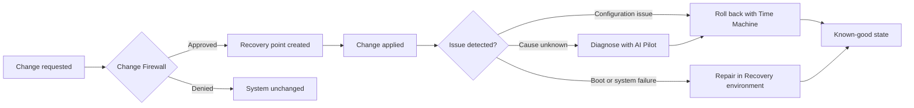

  

<h3 align="center">A Linux desktop where every sensitive change is visible, controllable, and reversible.</h3>

  
  
  
  

## Table of Contents

1. [Overview](#overview)
2. [Design Principles](#design-principles)
3. [Core Capabilities](#core-capabilities)
4. [How It Works](#how-it-works)
5. [Architecture](#architecture)
6. [Screenshots](#screenshots)
7. [Target Users](#target-users)
8. [Project Status](#project-status)
9. [Roadmap](#roadmap)
10. [Getting Started](#getting-started)
11. [FAQ](#faq)
12. [Contributing](#contributing)
13. [Security Policy](#security-policy)
14. [License](#license)

## Overview

**Heldo OS** is a Linux-based operating system that integrates system protection, recovery, isolated development environments, and AI-assisted troubleshooting into a single desktop.

Conventional operating systems make it easy to modify the system and difficult to audit or reverse those modifications. Heldo OS takes the opposite approach: every sensitive change is surfaced to the user, requires explicit approval, and can be undone.

> [!NOTE]
> Heldo OS is under active development. Components are at different stages of maturity. See [Project Status](#project-status) for details.

### The problem

- Package updates and scripts can alter system configuration without the user's knowledge.
- Project dependencies accumulate on the host and degrade system stability over time.
- Diagnosing failures typically means manual log analysis and forum searches.
- Reverting a bad change often requires a full reinstall or an external backup.

Heldo OS addresses these issues at the operating system level rather than through add-on tools.

## Design Principles

| Principle | Description |
|:--|:--|
| **Security** | Protection is part of the base system, not an optional add-on. |
| **Control** | The user decides what is permitted to change the system. |
| **Transparency** | System activity is visible and explained in plain language. |
| **Isolation** | Development workloads run separately from the host. |
| **Recoverability** | Unwanted changes can be reversed. |

## Core Capabilities

  

| Capability | Description |
|:--|:--|
| **Change Firewall** | Monitors sensitive system changes and requires user approval before they are applied. |
| **Time Machine** | Creates recovery points and restores the system to a previous known-good state. |
| **Recovery** | A dedicated environment for repairing boot and configuration failures. |
| **AI Pilot** | Provides assisted diagnostics. It explains issues and proposes fixes, and acts only with user approval. |
| **Project Bubbles** | Isolated development environments that separate project dependencies and workloads from the host. |
| **Heldo Software** | A unified interface for installing and updating software. |

<b>Project Bubbles: supported environments</b>

 

| Languages and Runtimes | Platforms and Workloads |
|:--|:--|
| Python | Cloud development |
| Web development | DevOps |
| Java | Kubernetes |
| C / C++ | Containers |
| Go | AI / ML |

<b>Security foundation</b>

 

| Domain | Controls |
|:--|:--|
| Access control | AppArmor, privilege management |
| Network | Firewall management |
| Auditing | System auditing |
| Isolation | Application isolation, sandboxed workloads |
| Maintenance | Security updates, secure system configuration |

## How It Works

Heldo OS follows a three-stage model: **review, protect, recover.**

| Stage | Behavior |
|:--|:--|
| **Review** | Sensitive changes are presented as explicit prompts instead of being applied silently. |
| **Protect** | Approved changes are backed by recovery points. |
| **Recover** | If a problem occurs, the user can roll back, repair, or request diagnostics from AI Pilot. |

## Architecture

Heldo OS combines a customized desktop and a set of Heldo tools on top of a standard Linux core. The system is organized into three pillars, with AI Pilot providing assistance across all of them.

  

## Screenshots

   
  <b>Desktop</b>

   
  <b>Application Center</b>

## Target Users

Heldo OS is designed for professionals who need a controlled, recoverable, and well-isolated workstation:

| | | | |
|:--|:--|:--|:--|
| Software developers | Cloud engineers | DevOps engineers | Site reliability engineers |
| System administrators | Security engineers | AI / ML engineers | Linux power users |

## Project Status

| Component | Stage |
|:--|:--|
| Core system design |  |
| Custom desktop |  |
| Change Firewall |  |
| Time Machine |  |
| Recovery environment |  |
| Project Bubbles |  |
| Heldo Software |  |
| AI Pilot |  |

## Roadmap

- [x] Core concept and system design
- [x] Custom desktop experience
- [ ] Change Firewall: policy engine and approval prompts
- [ ] Time Machine: recovery points and rollback
- [ ] Recovery: boot and configuration repair environment
- [ ] Project Bubbles: initial set of isolated environments
- [ ] Heldo Software: unified install and update experience
- [ ] AI Pilot: assisted diagnostics with user approval
- [ ] First public ISO release

Feature requests are tracked through [GitHub Issues](../../issues).

## Getting Started

Installation images and instructions will be published with the first public release.

To be notified, use **Watch › Custom › Releases** on this repository.

## FAQ

<b>Is Heldo OS a new Linux distribution?</b>

 
Heldo OS is a Linux-based operating system consisting of a customized desktop and a set of Heldo tools built on a standard Linux core.

<b>Can it be installed today?</b>

 
Not yet. Installation images will be published with the first public release.

<b>Does AI Pilot modify the system automatically?</b>

 
No. AI Pilot is designed for assisted diagnostics with user approval. The user remains in control of every change that is applied.

<b>Is Heldo OS open source?</b>

 
A license has not been selected yet. See <a href="#license">License</a>.

## Contributing

Bug reports, feature proposals, and feedback are welcome.

1. Fork the repository.
2. Create a branch: `git checkout -b feature/short-description`.
3. Commit your changes with a clear, descriptive message.
4. Open a pull request describing the change and its motivation.

For questions or proposals, please [open an issue](../../issues).

## Security Policy

Please report security vulnerabilities **privately** to the maintainer. Do not open a public issue for security-related reports.

## License

A license has not yet been selected. Until one is added, all rights are reserved by the author.

  <b>HELDO OS</b> &nbsp;·&nbsp; Security &nbsp;·&nbsp; Control &nbsp;·&nbsp; Recovery

