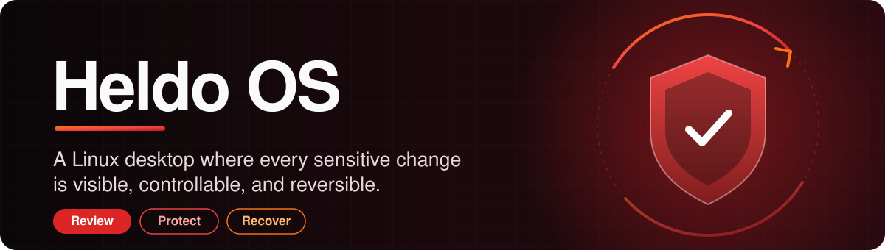
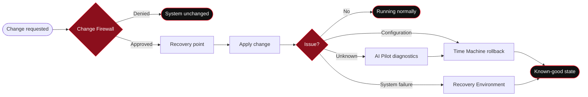
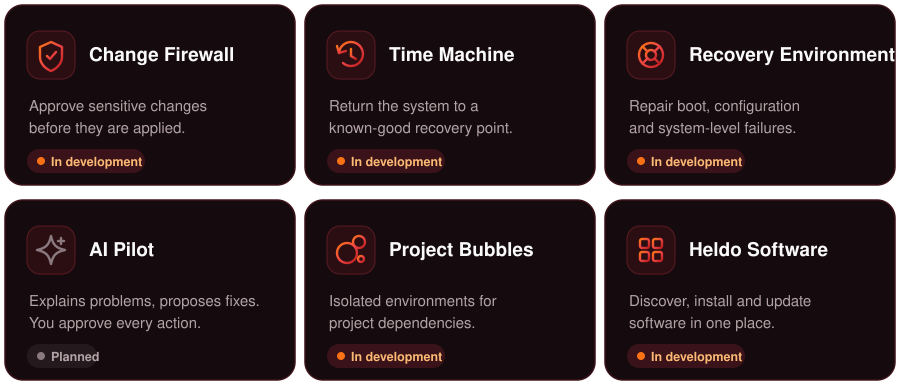
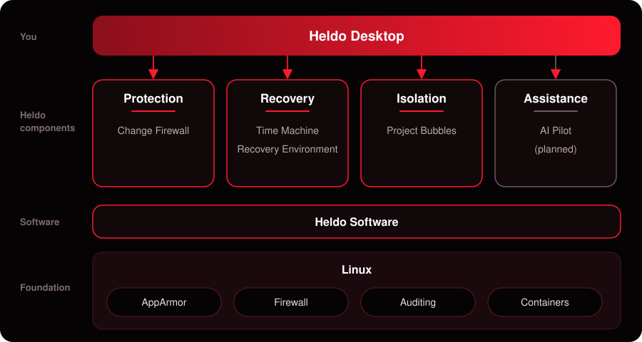
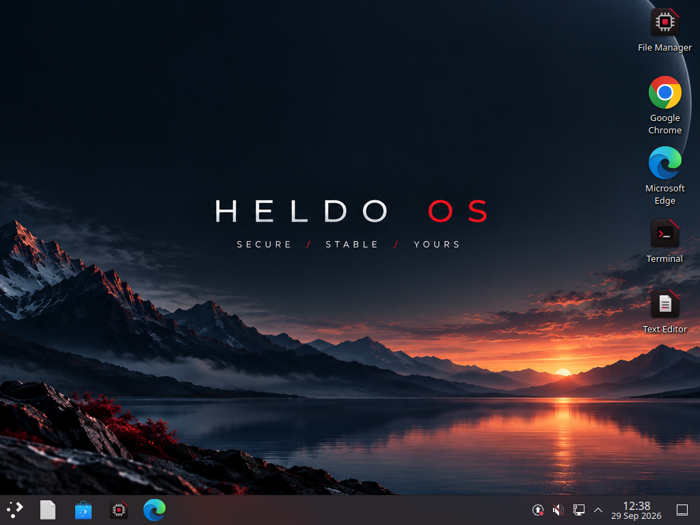
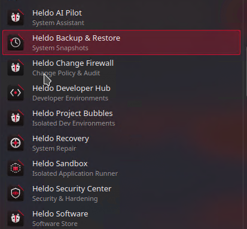

  

  
  
  

  <a href="#overview">Overview</a> ·
  <a href="#how-a-change-flows">How it works</a> ·
  <a href="#components">Components</a> ·
  <a href="#architecture">Architecture</a> ·
  <a href="#roadmap">Roadmap</a> ·
  <a href="#faq">FAQ</a> ·
  <a href="#contributing">Contributing</a>

> [!WARNING]
> **Heldo OS is in active development and has no public release yet.** Don't rely on unreleased components for production systems or critical workloads.

## Overview

**Heldo OS is a Linux desktop for engineering workstations where nothing sensitive changes without you knowing.** Every important change is shown to you, needs your approval, and can be undone.

| | |
|:--|:--|
| **Core idea** | Review → Protect → Recover |
| **Built for** | Developers, cloud / DevOps / SRE, sysadmins, security engineers, AI / ML engineers, Linux power users |
| **Includes** | Change approval, recovery points, a repair environment, isolated project environments, a software center, AI-assisted diagnostics |
| **Platform** | Linux |
| **Status** | In development. No installable image yet |
| **License** | Not chosen yet. All rights reserved by the author |

### Three ideas, one desktop

| 1. Review | 2. Protect | 3. Recover |
|:--|:--|:--|
| Sensitive changes are shown to you, never applied silently. | Every approved change gets a recovery point first. | If something breaks, roll back or boot the repair environment. |
| **Change Firewall** | **Time Machine** | **Recovery Environment** · **AI Pilot** |

### Why it exists

| Today on a Linux workstation | With Heldo OS |
|:--|:--|
| A package install changes system configuration | Change Firewall asks you first |
| A script makes privileged changes you can't see | Sensitive operations are surfaced and explained |
| Project dependencies pile up on the host | Project Bubbles keep them isolated |
| A failure means manual investigation | AI Pilot explains likely causes |
| A bad configuration is hard to undo | Time Machine restores a known-good state |
| An AI tool runs fixes you didn't approve | You approve every action that changes the system |

### Design principles

- **Security:** controls are part of the OS, not optional add-ons.
- **Control:** you decide what can change the system.
- **Transparency:** activity is shown in plain terms.
- **Isolation:** development work stays off the host.
- **Recoverability:** every change has a way back.

## How a change flows

1. **Request:** something asks to change the system (a package, a script, a setting).
2. **Review:** Change Firewall shows you what will change. You approve or deny.
3. **Protect:** if approved, a recovery point is created.
4. **Apply:** the change is made.
5. **Recover:** if something goes wrong, you pick the way back:

| Symptom | Go to |
|:--|:--|
| A configuration problem | **Time Machine** rollback |
| The system won't boot or work | **Recovery Environment** |
| You don't know the cause | **AI Pilot** diagnostics, then roll back if needed |

## Components

  

| Component | What it does | Status |
|:--|:--|:--|
| **Change Firewall** | Watches sensitive changes and asks for approval before they apply. | 🔨 In development |
| **Time Machine** | Creates recovery points so you can return to a known-good state. | 🔨 In development |
| **Recovery Environment** | A separate environment for repairing boot, configuration and system failures. | 🔨 In development |
| **Project Bubbles** | Isolated environments for project dependencies and workloads. | 🔨 In development |
| **Heldo Software** | One place to find, install and update software. | 🔨 In development |
| **AI Pilot** | Analyzes problems, explains causes and proposes fixes. It never changes the system on its own. | 🗓️ Planned |
| Core design and custom desktop | The foundation the components build on. | ✅ Done |

### Project Bubbles

Each project gets its own environment, so dependencies and workloads never touch the host.

| Languages and runtimes | Engineering workloads |
|:--|:--|
| Python · Java · C / C++ · Go · Web | Cloud · DevOps · Kubernetes · Containers · AI / ML |

### Security foundation

| Area | Controls |
|:--|:--|
| Access control | AppArmor, privilege management |
| Network | Firewall management |
| Auditing | System activity and security auditing |
| Isolation | Application isolation, sandboxed workloads |
| Maintenance | Security updates, secure configuration |

## Architecture

  

| Pillar | Purpose |
|:--|:--|
| **Protection** | Control and monitor sensitive operations |
| **Recovery** | Recovery points and a dedicated repair environment |
| **Isolation** | Keep development workloads away from the host |
| **Assistance** | AI-assisted diagnostics and troubleshooting |

## Screenshots

<table>
  <tr>
    <td align="center" width="50%">
       
      <b>Desktop</b>
    </td>
    <td align="center" width="50%">
       
      <b>Heldo Software</b>
    </td>
  </tr>
</table>

## Who it's for

| If you are a... | Heldo OS gives you... |
|:--|:--|
| **Software developer** | Isolated environments and clean dependency management |
| **Cloud engineer** | Cloud tooling and infrastructure workflows without host clutter |
| **DevOps engineer / SRE** | Containers, Kubernetes, CI/CD and fast recovery |
| **System administrator** | Controlled, reviewable system changes |
| **Security engineer** | A workstation with security built in |
| **AI / ML engineer** | Isolated environments for AI work |
| **Linux power user** | Visibility into every system change |

## Roadmap

| Phase | Goal | Status |
|:--|:--|:--|
| **1. Foundation** | Concept, architecture, custom desktop | ✅ Done |
| **2. Protection** | Approve and review sensitive changes | 🔨 In development |
| **3. Recovery** | Roll back and repair | 🔨 In development |
| **4. Development** | Isolated project environments | 🔨 In development |
| **5. Software** | Install and update from one place | 🔨 In development |
| **6. Intelligence** | Diagnostics you stay in control of | 🗓️ Planned |
| **7. Release** | First public ISO and docs | 🗓️ Planned |

<b>Full task list</b>

 

**Foundation**
- [x] Core system concept
- [x] System architecture
- [x] Custom desktop experience

**Protection**
- [ ] Change Firewall policy engine
- [ ] Protected operation detection
- [ ] Approval and review interface
- [ ] System activity visibility

**Recovery**
- [ ] Time Machine recovery points
- [ ] System rollback
- [ ] Recovery environment
- [ ] Boot repair workflows

**Development**
- [ ] Project Bubbles
- [ ] Initial development environments
- [ ] Container and Kubernetes workflows
- [ ] Cloud development environments

**Software**
- [ ] Heldo Software application center
- [ ] Software installation workflows
- [ ] Software update management

**Intelligence**
- [ ] AI Pilot diagnostics
- [ ] Log and error analysis
- [ ] Suggested remediation
- [ ] User-approved remediation workflows

**Release**
- [ ] First public ISO
- [ ] Installation documentation
- [ ] Release process
- [ ] Public documentation

Feature requests and discussion: [GitHub Issues](../../issues).

## Getting started

There is no installation image yet. ISO images and instructions will be published with the first public release.

**To get notified:** GitHub → Watch → Custom → Releases

## FAQ

<b>Is Heldo OS a Linux distribution?</b>

 

It's built on a standard Linux foundation, with a customized desktop and Heldo-specific system components.

<b>Can I install it today?</b>

 

Not yet. Public images will ship with the first public release.

<b>Does AI Pilot change my system automatically?</b>

 

No. AI Pilot explains problems and proposes solutions. You stay in control of any action that modifies the system.

<b>What are Project Bubbles?</b>

 

Isolated development environments that keep project dependencies and workloads separate from the host OS.

<b>Is Heldo OS open source?</b>

 

The license hasn't been chosen yet. Until one is published, all rights remain with the author.

## Contributing

Contributions, technical feedback, bug reports and feature proposals are welcome.

1. Fork the repository and create a branch: `git checkout -b feature/short-description`
2. Make your changes and test them locally.
3. Commit with a clear message: `git commit -m "Add short description of change"`
4. Push and open a pull request: `git push origin feature/short-description`

In the pull request, explain **what** changed, **why**, **how you tested it**, and any **known limitations**. For questions or proposals, open an [Issue](../../issues).

## Security policy

Found a potential vulnerability?

- **Don't** report it in a public GitHub issue.
- Report it privately to the project maintainer, with enough detail to reproduce it.
- Please don't share exploit details publicly until it has been investigated.

A dedicated reporting process will be published before the first public release.

## License

No license has been selected yet. Until one is added, **all rights are reserved by the author**.

  

