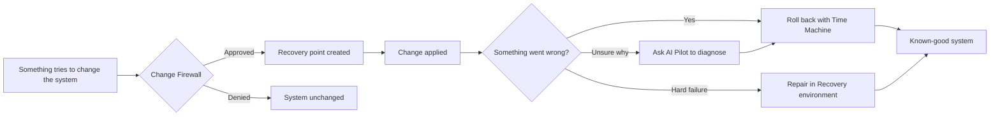

  

<h3 align="center">A Linux desktop where every sensitive change is visible, controllable, and reversible.</h3>

  
  
  
  

  <a href="#why-heldo-os"><b>Why</b></a> &nbsp;•&nbsp;
  <a href="#core-capabilities"><b>Capabilities</b></a> &nbsp;•&nbsp;
  <a href="#how-it-works"><b>How it works</b></a> &nbsp;•&nbsp;
  <a href="#architecture"><b>Architecture</b></a> &nbsp;•&nbsp;
  <a href="#screenshots"><b>Screenshots</b></a> &nbsp;•&nbsp;
  <a href="#project-status"><b>Status</b></a> &nbsp;•&nbsp;
  <a href="#roadmap"><b>Roadmap</b></a> &nbsp;•&nbsp;
  <a href="#faq"><b>FAQ</b></a> &nbsp;•&nbsp;
  <a href="#contributing"><b>Contributing</b></a>

## Overview

**Heldo OS** is a Linux-based operating system that brings **system protection**, **recovery**, **isolated development environments**, and **AI-assisted troubleshooting** together in one desktop.

Most operating systems make it easy to change the system and hard to understand or undo those changes. Heldo OS is built on the opposite principle:

> **Control your system. Understand what is happening. Recover when something goes wrong.**

> [!NOTE]
> Heldo OS is under active development. Components are at different stages of maturity. See [Project Status](#project-status).

## Why Heldo OS

Developers and administrators routinely run into the same problems:

- A package update or script silently changes system configuration, and nobody knows what changed.
- Project dependencies pollute the host until the machine becomes fragile.
- When something breaks, the fix is a late-night search through logs and forums.
- Rolling back means a full reinstall, or hoping a backup exists.

Heldo OS addresses these at the system level instead of leaving them to add-on tools.

| | Principle | What it means |
|:-:|:--|:--|
| 🔐 | **Security** | Protection is part of the base system, not an add-on. |
| 🎛️ | **Control** | You decide what is allowed to change the system. |
| 🔍 | **Transparency** | System activity is visible and explained in plain language. |
| 📦 | **Isolation** | Development workloads run apart from the host. |
| ⏪ | **Recoverability** | Unwanted changes can be reversed. |

## Core Capabilities

  

| Capability | What it does |
|:--|:--|
| 🛡️ **Change Firewall** | Watches sensitive system changes and asks for your approval before they apply, so nothing modifies your system unnoticed. |
| ⏪ **Time Machine** | Creates recovery points and lets you roll the system back to a known-good state. |
| 🧰 **Recovery** | A dedicated environment for repairing boot and configuration problems when the system will not start normally. |
| 🤖 **AI Pilot** | Assists with diagnostics and troubleshooting. It explains what is happening and proposes fixes, but acts only with your approval. |
| 🫧 **Project Bubbles** | Isolated development environments that keep project dependencies and workloads away from the host system. |
| 📦 **Heldo Software** | A unified experience for installing and updating software. |

<b>Project Bubbles: supported environments</b>

 

| Languages and runtimes | Platforms and workloads |
|:--|:--|
| Python | Cloud Development |
| Web Development | DevOps |
| Java | Kubernetes |
| C / C++ | Containers |
| Go | AI / ML |

<b>Security foundation</b>

 

| Domain | Controls |
|:--|:--|
| Access control | AppArmor, privilege management |
| Network | Firewall management |
| Auditing | System auditing |
| Isolation | Application isolation, sandboxed workloads |
| Maintenance | Security updates, secure system configuration |

## How It Works

The three core ideas work together as a loop: **review → protect → recover.**

1. **Review.** Sensitive changes surface as clear prompts instead of happening silently.
2. **Protect.** Approved changes are backed by recovery points.
3. **Recover.** If something breaks, you can roll back, repair, or ask AI Pilot to help find the cause.

## Architecture

Heldo OS combines a customized desktop and a set of Heldo tools on top of a standard Linux core, organized into three pillars. AI Pilot assists across all of them.

  

## Screenshots

   
  <b>Desktop</b>

   
  <b>Application Center</b>

## Who It's For

<table align="center">
  <tr>
    <td align="center" width="25%"><b>Software Developers</b></td>
    <td align="center" width="25%"><b>Cloud Engineers</b></td>
    <td align="center" width="25%"><b>DevOps Engineers</b></td>
    <td align="center" width="25%"><b>SRE Engineers</b></td>
  </tr>
  <tr>
    <td align="center"><b>System Administrators</b></td>
    <td align="center"><b>Security Engineers</b></td>
    <td align="center"><b>AI / ML Engineers</b></td>
    <td align="center"><b>Linux Enthusiasts</b></td>
  </tr>
</table>

## Project Status

| Component | Stage |
|:--|:--|
| Core system design |  |
| Custom desktop |  |
| Change Firewall |  |
| Time Machine |  |
| Recovery environment |  |
| Project Bubbles |  |
| Heldo Software |  |
| AI Pilot |  |

## Roadmap

- [x] Core concept and system design
- [x] Custom desktop experience
- [ ] **Change Firewall:** policy engine and approval prompts
- [ ] **Time Machine:** recovery points and rollback
- [ ] **Recovery:** boot and configuration repair environment
- [ ] **Project Bubbles:** initial set of isolated environments
- [ ] **Heldo Software:** unified install and update experience
- [ ] **AI Pilot:** assisted diagnostics with user approval
- [ ] **First public ISO release**

Have a feature idea? [Open an issue](../../issues) and tell us what you need.

## FAQ

<b>Is Heldo OS a new Linux distribution?</b>

 
Heldo OS is a Linux-based operating system: a customized desktop and a set of Heldo tools built on a standard Linux core.

<b>Can I install it today?</b>

 
Not yet. Installation images will be published with the first public release. Watch this repository to be notified.

<b>Will AI Pilot change my system on its own?</b>

 
No. AI Pilot is designed for assisted diagnostics with user approval. You stay in control of what is applied.

<b>Is it free and open source?</b>

 
A license has not been selected yet. See [License](#license).

## Getting Started

Installation images and instructions will be published with the first public release.

**Stay updated:** click **Watch › Custom › Releases** at the top of this repository, and **⭐ star** the project to show support.

## Contributing

Bug reports, feature ideas, and feedback are welcome.

1. Fork the repository
2. Create a branch: `git checkout -b feature/short-description`
3. Commit your changes with a clear message
4. Open a pull request describing the change

For questions or proposals, [open an issue](../../issues).

## Security

If you discover a security vulnerability, please report it **privately** to the maintainer instead of opening a public issue.

## License

A license has not yet been selected. Until one is added, all rights are reserved by the author.

  <b>HELDO OS</b> &nbsp;·&nbsp; Security &nbsp;·&nbsp; Control &nbsp;·&nbsp; Recovery

